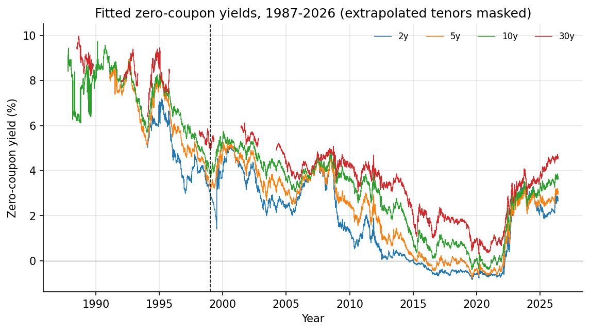
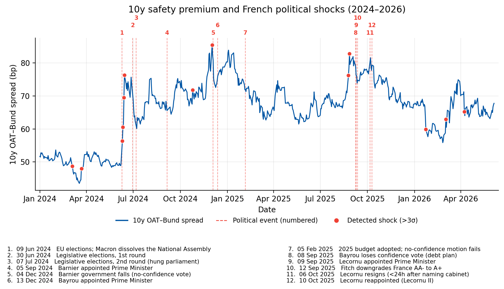
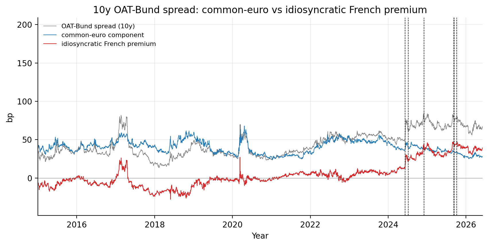
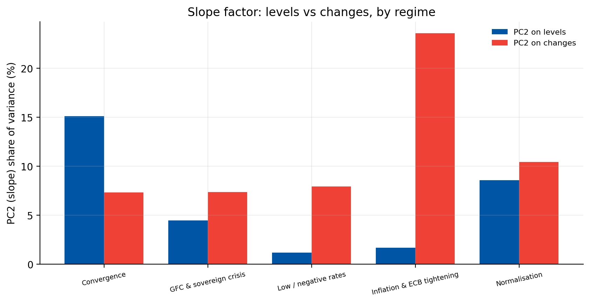
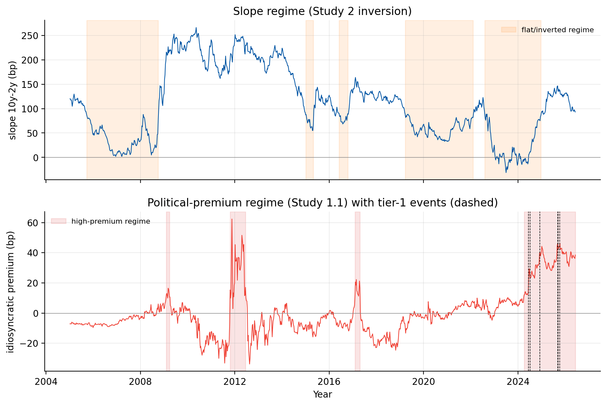

# The French Sovereign Yield Curve across Regimes

**Political risk, monetary tightening and market dislocation in the OAT market, 1987–2026.**

Code for my MSc in Finance thesis (University of Pavia, 2026). The project
estimates the French zero-coupon government yield curve **every trading day
for almost 40 years** from raw Bloomberg bond prices, then uses it to study
three questions the original literature could not see:

1. How much did the 2024–26 French political crisis reprice the OAT–Bund
   spread, how much of that is French rather than euro-wide risk, and does
   that premium reach the real economy?
2. Did the 2022–24 ECB tightening change the factor structure of the curve?
3. Can the shifts between calm and stressed regimes be dated formally?

The core is a from-scratch replication of Grishchenko, Moraux & Pakulyak
(2020), *"Fuel up with OATmeals! The case of the French nominal yield curve"*
(Journal of Finance and Data Science), extended from April 2018 to June 2026.



---

## Highlights

| | |
|---|---|
| **Data** | 155 fixed-coupon OAT/BTAN lines, 10,077 trading days (Oct 1987 – Jun 2026); German Bund universe 1999–2026; ECB Data Portal series via SDMX API |
| **Curve fit** | Svensson (1994) model, Gürkaynak–Sack–Wright (2007) method, duration-weighted least squares on dirty prices. Mean absolute yield error **2.39 bp** over 1999–2018, **3.58 bp** after 2018 |
| **Replication** | Paper's results reproduced: fit quality by maturity bin, PC1 ≈ 96.5% of yield-level variance, negligible on-the-run premium |
| **Political risk** | The 9 June 2024 dissolution of the National Assembly widened the 10y OAT–Bund spread by **+24.6 bp in five days (t ≈ 12)**; the average spread moved from **28.6 to 69.4 bp** |
| **Decomposition** | Euro-wide factors explain at most a fifth of daily spread variance: **81.5–88.9% is idiosyncratic French risk**. The French-specific premium went from about zero (2019) to **~40 bp** |
| **Transmission** | Spread pass-through to French corporate loan rates of 0.67 (t = 8.1), implying **+0.21 pp** on borrowing costs, in line with INSEE's +0.2 pp estimate |
| **Factor structure** | PCA on yield *changes*: the slope factor carries **23.6%** of variance during the 2022–24 tightening, against 7–10% in every other regime |
| **Regimes** | Markov-switching (Hamilton), Bai–Perron multiple breaks and CUSUM date a flat/inverted-slope regime in 2022–24, a high political-premium regime from mid-2024 and a structural rise in pricing noise from July 2022 |

<table>
<tr>
<td></td>
<td></td>
</tr>
<tr>
<td></td>
<td></td>
</tr>
</table>

---

## Methodology

### Daily curve estimation

The zero-coupon curve is not observable: it has to be inferred from the prices
of coupon bonds. Each day, the Svensson instantaneous forward curve

$$
f(m) = \beta_0 + \beta_1 e^{-m/\tau_1} + \beta_2 \frac{m}{\tau_1} e^{-m/\tau_1} + \beta_3 \frac{m}{\tau_2} e^{-m/\tau_2}
$$

is integrated into the zero-coupon yield $y(m) = \frac{1}{m}\int_0^m f(s)\,ds$,
and its six parameters are estimated by minimising duration-weighted squared
price errors across all eligible bonds:

$$
\hat\theta_t = \arg\min_{\theta} \sum_{k} \left( \frac{P^{\text{obs}}_{k,t} - P_k(\theta)}{D_{k,t}} \right)^2
$$

where $P^{\text{obs}}$ is the dirty bid price, $P_k(\theta)$ discounts the
bond's cash flows on the fitted curve and $D$ is modified duration, so price
errors become approximately yield errors. $\beta_0$ is the long-run level,
$\beta_0+\beta_1$ the instantaneous short rate (left free, so rates can be
negative), and $\beta_2, \beta_3$ shape the medium-term humps.

Implementation details that matter in practice:

- **Bond mechanics from scratch**: annual coupon schedules, ACT/ACT (ICMA)
  accrued interest, yield-to-maturity by Brent's method, Macaulay and modified
  duration (`oatcurve/bonds.py`).
- **Bounded trust-region least squares** (`scipy.optimize.least_squares`,
  `trf`), warm-started from the previous day's solution, with a multi-start
  fallback when the fit is poor (`oatcurve/estimation.py`).
- **Data-quality screens**: the paper's static filters, a plausibility band on
  implied yields, and robust outlier rejection on fitted residuals
  (`max(75 bp, median + 6·MAD)`).
- Every function is mapped to the paper's equation numbers; see
  [`docs/replication.md`](docs/replication.md) for the full equation → code map.

### Supplementary studies

| Study | Method | Code |
|---|---|---|
| 1. Political risk | German Bund curve fitted with the same engine; OAT–Bund spread; data-driven shock detection; event study with cumulative abnormal spread changes; rolling beta | `studies/political_risk.py`, `studies/bund_curve.py` |
| 1.1 Premium decomposition | Regression of daily spread changes on euro-wide factors (ECB CISS, periphery dispersion, Bund moves); idiosyncratic residual premium by maturity; pass-through to corporate loan rates | `studies/political_premium.py` |
| 2. PCA by regime | PCA on levels and on changes per policy regime; Lord & Pelsser (2007) sign-change test; weekly vs daily robustness; Ledoit–Wolf shrinkage | `studies/pca_regimes.py` |
| 3. Market dislocation | Fit-error (noise) diagnostics by maturity bin across crisis episodes; recovery half-lives; leave-one-out robustness | `studies/crisis_dislocation.py` |
| 3.1 Regime detection | Markov-switching regression (`statsmodels`), Bai–Perron breaks with BIC selection (`ruptures`), CUSUM stability test; corroboration with CISS and the political calendar | `studies/regime_detection.py` |

More detail in [`studies/README.md`](studies/README.md); literature in
[`studies/REFERENCES.md`](studies/REFERENCES.md).

---

## Repository structure

```
oatcurve/        estimation engine: one module per section of the paper
  svensson.py      forward, zero, par yields and discount factors
  bonds.py         cash flows, accrued interest, YTM, durations
  estimation.py    daily cross-section, filters, WLS fit, robust refit
  metrics.py       MAE by maturity bin, noise measure
  pipeline.py      day-by-day loop with warm starts; curve reconstruction
  analysis.py      level/slope/curvature, PCA, summary tables
  otr.py           on-the-run premium
studies/         the five supplementary studies + ECB API client
scripts/         01 build panel · 02 fit curves · 03 figures/tables · 04 on-the-run · 05 Bund curve · 06 run notebooks
notebooks/       executed notebooks with figures (one per study) and the scripts that build them
tests/           unit tests on synthetic data (no Bloomberg data needed)
data/            place the Bloomberg exports here (not distributed, see data/README.md)
docs/            replication notes and README figures
```

---

## Running it

```bash
pip install -r requirements.txt

python scripts/01_build_panel.py     # parse Bloomberg exports, filter, cache   (seconds)
python scripts/02_fit_curves.py      # fit all 10,077 days                      (~9 min)
python scripts/03_make_outputs.py    # figures and tables                       (seconds)
python scripts/05_fit_bund_curve.py  # German curve for the political studies  (~4 min)
python scripts/06_execute_notebooks.py
```

The Bloomberg price data are licensed and **not included**; the expected file
layout is documented in [`data/README.md`](data/README.md). The executed
notebooks in `notebooks/` show every result without needing the data.
ECB series are downloaded automatically and cached on first use.

### Tests

```bash
pip install -r requirements-dev.txt
pytest
```

The tests run on synthetic bond markets, so they need no data. They check the
Svensson algebra (the zero yield equals the average forward rate, par bonds
price at par), bond mechanics against finite differences, recovery of a known
curve from exact prices, and the outlier screen. They run on every push via
GitHub Actions.

### Reproducibility

Re-running the full pipeline from the raw exports reproduces the thesis
curves bit for bit: all 10,077 daily parameter vectors and zero, par and
forward curves match with zero difference. Note that the
daily fit is **path-dependent**: the Svensson objective has several local
minima, and each day starts from the previous day's solution. A run on a
sub-period (e.g. `02_fit_curves.py 2026-01-01 2026-06-05`) starts cold and can
settle 1–3 bp away from the full-sample curve; starting from the same previous
day, it matches to machine precision.

---

## Known limitations

- **Outlier masking at the edges of the maturity range.** Outliers are screened
  on the residuals of a first, non-robust fit. A gross error on the shortest
  (or longest) bond can bend the curve towards itself, so the screen removes a
  neighbour instead. This is documented by an expected-failure test
  (`tests/test_estimation.py::test_robust_fit_edge_bond_masking`). A
  leave-one-out or Huber-loss first pass would fix it.
- **Pre-euro short end.** Before ~1993 there were no short-maturity OATs, so the
  curve below ~2 years is an extrapolation (masked in the figures).
- **Reduced-form evidence.** Event studies and decompositions are associational;
  the idiosyncratic premium is a residual that also absorbs liquidity effects.
- **Speed.** Yield-to-maturity is solved bond by bond; a vectorised Newton step
  over a padded cash-flow matrix should cut the full run from ~9 minutes to one or two.

---

## Reference

Grishchenko, O. V., Moraux, F., & Pakulyak, O. (2020). Fuel up with OATmeals!
The case of the French nominal yield curve. *The Journal of Finance and Data
Science*, 6, 49–85.

## Author

**Andrea Faraon** · MSc in Finance, University of Pavia ·
[LinkedIn](https://www.linkedin.com/in/andrea-faraon-3378553b5)

Thesis supervisor: Prof. Patrizio Tirelli.

## License

© 2026 Andrea Faraon. All rights reserved. The code is published so that it
can be read and reviewed; please get in touch before reusing it. Bloomberg data
are not included and remain subject to Bloomberg's terms.
